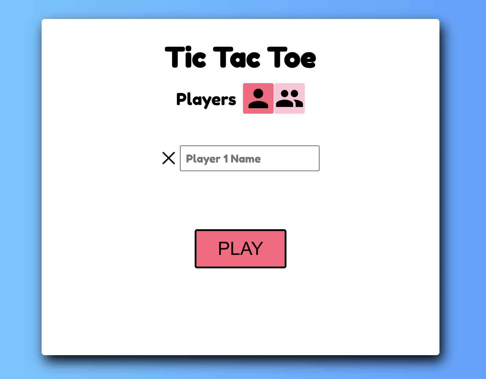
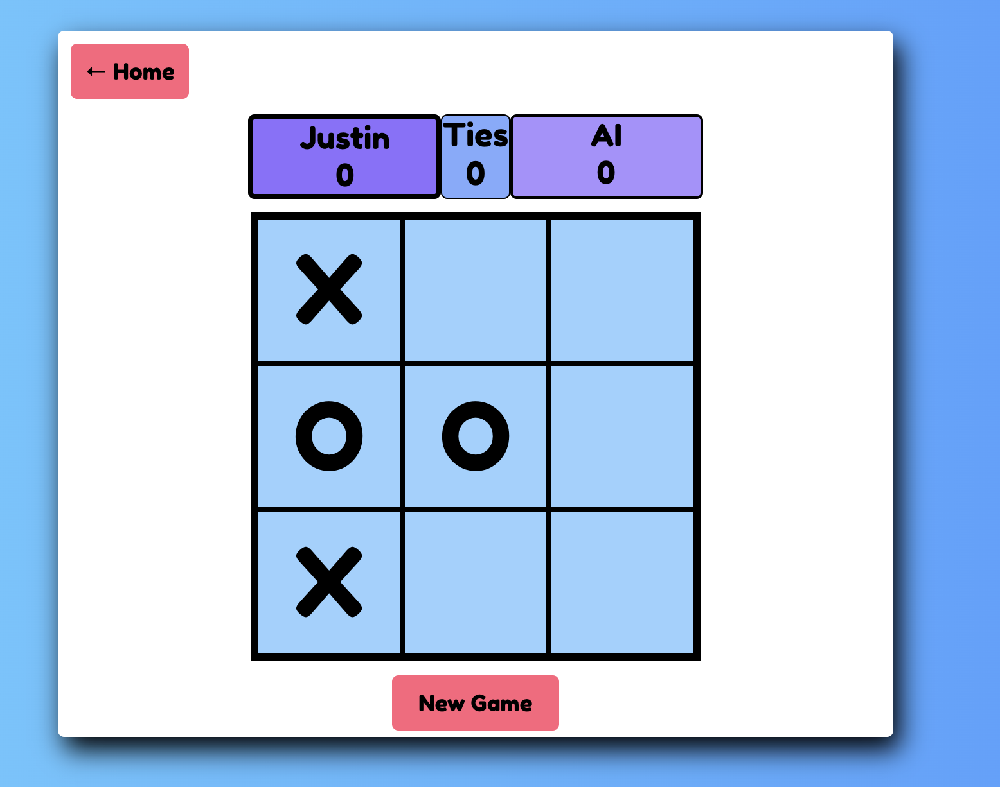

# Tic Tac Toe

This is an awesome **_Tic Tac Toe_** game, fully optimized for _desktop_ and _mobile_.

**_Artificial Intelligence_**: To create the **_AI_** for this game I used the [Mini-Max](https://en.wikipedia.org/wiki/Minimax) algorithm, which is a recursive algorithm used in decision-making and game theory.

> **Home page**

# 

## Table of contents

1. [Demo](#demo)
2. [Technologies](#technologies)
3. [Features](#features)
4. [Development](#development)

## Demo

Here is the working live demo:
[https://justinkar.github.io/tic-tac-toe/](https://justinkar.github.io/tic-tac-toe/).

## Technologies

- Javascript (ES6)
- ReactJS

## Features

- Single & multiplayer mode
- Unbeatable AI in single player mode
- Add player names
- Display scores
- Display player turns
- Restart game

> **_Game page_**

# 

## Development

To set up this App locally, clone this repo to your desktop and run `npm install` to install all the dependencies. Then `npm start` to launch the App.
